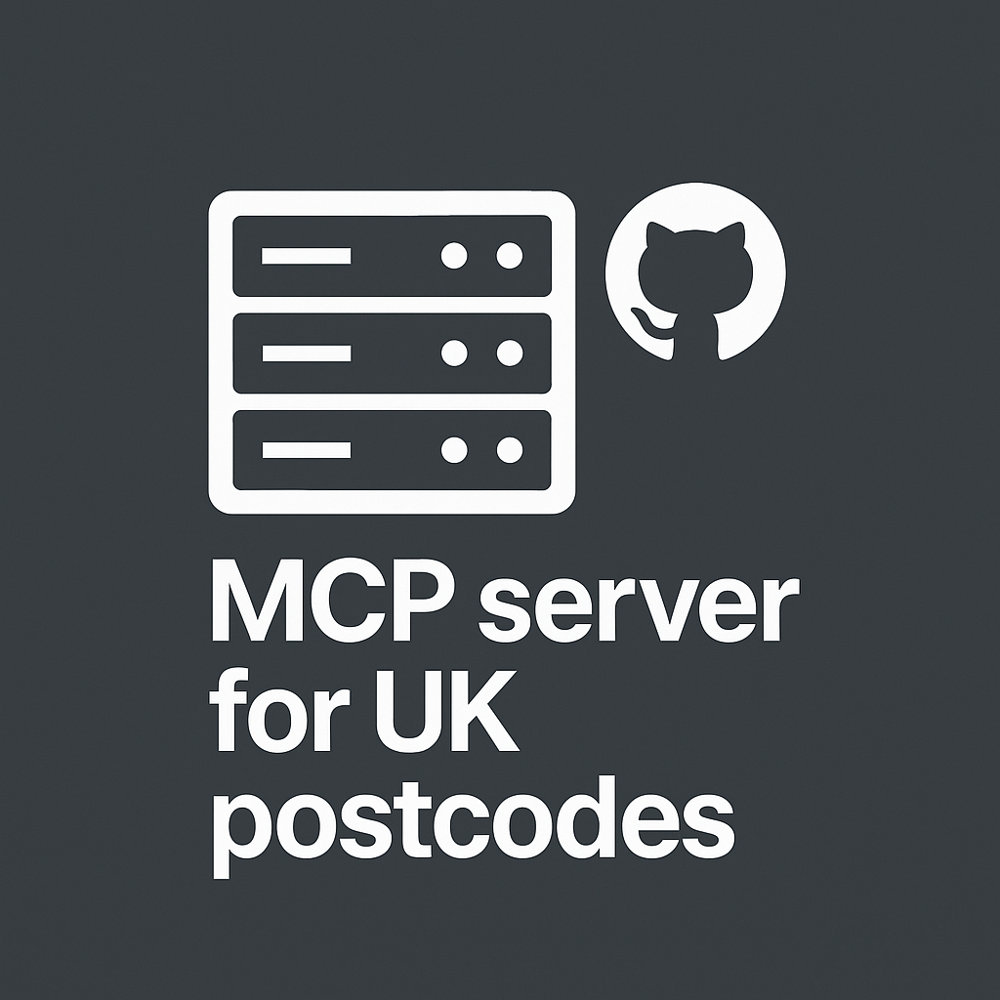
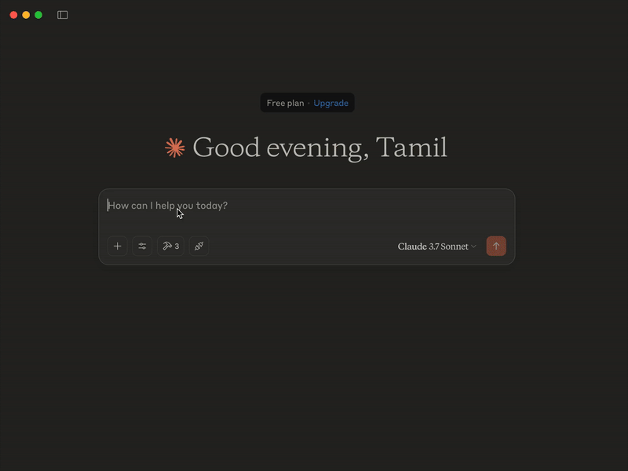

# Postcodes UK MCP Server


## Overview
Postcodes UK MCP Server provides an efficient way to interact with the UK Postcodes API ([postcodes.io](https://postcodes.io/)). It offers validation, lookup, and geographical search capabilities for UK postcodes.

## Features
- **Validate** UK postcodes
- **Retrieve** postcode details
- **Bulk postcode lookup**
- **Find nearest postcodes** by coordinates

## Dependencies
- Python 3.8+
- `mcp-cli` &  `httpx`

# Installation Steps

## 1. Install uv with official standalone installer:

For macOS and Linux 
```
$ curl -LsSf https://astral.sh/uv/install.sh | sh
```

For Windows
```
powershell -ExecutionPolicy ByPass -c "irm https://astral.sh/uv/install.ps1 | iex
```

## 2. Clone the repo
Then add MCP to your project dependencies:
```
uv add "mcp[cli]"
```

## 3. Make sure Claude Desktop App installed from [Claude](https://claude.ai/download)

## 4. Now install the Postcodes UK MCP Server to the Claude Desktop
    
    mcp install postcodes.py
    

You will see the output like this after successful installation

```    
INFO     Added server 'postcodes' to Claude config                                                      claude.py:129
INFO     Successfully installed postcodes in Claude app                                                    cli.py:467
``` 

## Usage
The server provides multiple methods to interact with UK postcode data:
- Lookup details for a single postcode
- Perform bulk postcode lookups
- Find nearest postcodes by geographic coordinates

## Demo on Claude Desktop:



## API Endpoints
| Endpoint | Description |
|----------|-------------|
| `/lookup/{postcode}` | Retrieve details for a single postcode |
| `/bulk-lookup` | Look up multiple postcodes at once |
| `/nearest?lat={lat}&lon={lon}` | Find nearest postcodes based on coordinates |

---
### 📌 **Contributing**
Contributions are welcome! Feel free to submit issues or pull requests.

### 📄 **License**
This project is licensed under the MIT License.

### ⭐ **Support**
If you find this project useful, please ⭐ star the repository! and Find me in [LinkedIn](https://www.linkedin.com/in/selva221724/)

---
Developed with ❤️ for UK postcode services.


